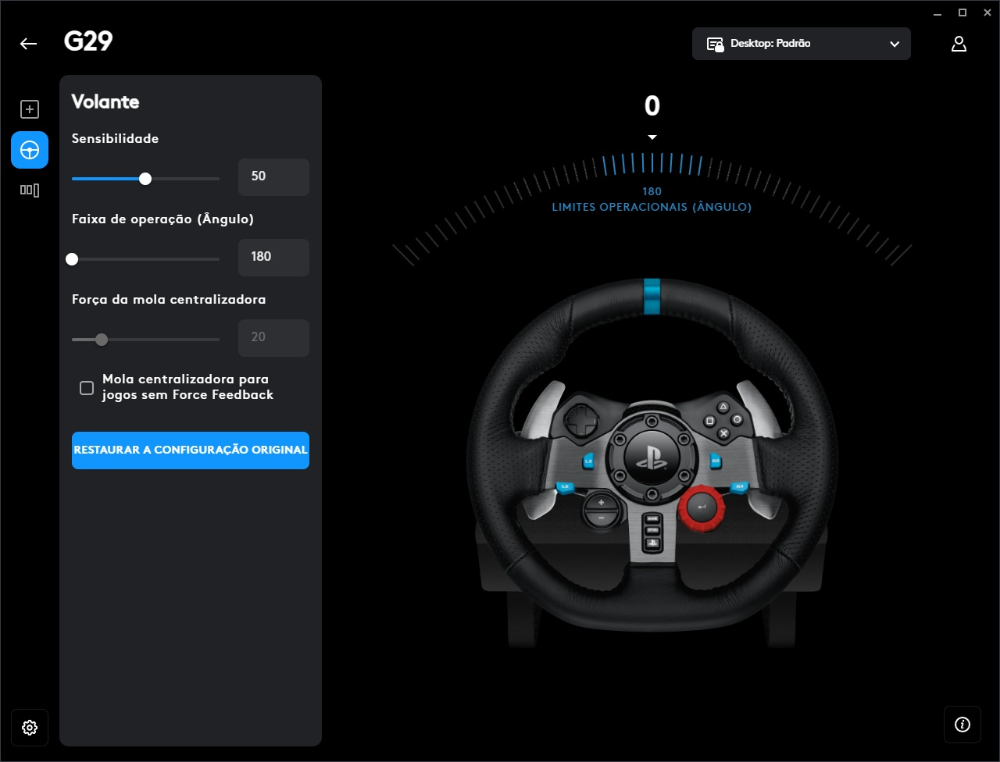

# G29 FFB Mod — NFSU2 — Installation & Configuration Reference

> Other languages: [Português](README_PT.md) · [Español](README_ES.md) · [Français](README_FR.md) · [Italiano](README_IT.md)

---

## Requirements

- Need for Speed Underground 2 — NA retail (`SPEED2.EXE` ~4.8 MB)
- Logitech G29 with **G HUB** installed and running before the game
- Windows 10 / 11 (64-bit)
- Visual Studio 2019/2022/2026 Community — workload: *Desktop development with C++*
- CMake 3.20+ (included with Visual Studio, or from cmake.org)

---

## G HUB Setup (required)

Before launching the game, open **Logitech G HUB** and configure the G29 as follows:



| Setting | Required value |
|---|---|
| **Operating Range (Angle) / Faixa de operação (Ângulo)** | **180°** |
| Sensitivity / Sensibilidade | 50 (default) |
| Centering Spring / Força da mola centralizadora | 20 (default) |
| Centering Spring for games without FFB | unchecked |

> The mod's dynamic steering system (240° → 180° → 120° with speed) is designed around a 180° G HUB operating range.
> Using a different value will make the virtual lock feel too wide or too narrow.

---

## Build

### Automatic

```bat
double-click:  mods\g29_ffb\build.bat
```

### Manual

```cmd
cmake -S mods\g29_ffb -B build_output -A Win32
cmake --build build_output --config Release
```

> x86 (32-bit) is required. NFSU2 is a 32-bit process.

The CMake post-build step copies `dinput8.dll` to your NFSU2 root automatically.

---

## Installation

1. **Build** the project (see above).
2. **Copy `config.ini`** from `mods\g29_ffb\config.ini` to your NFSU2 root folder.
3. **Launch the game.** The mod activates on first DirectInput device enumeration.
4. Check `logs\g29_ffb.log` for status messages.

> If you had a previous `dinput8.dll` (ASI loader), this mod includes built-in ASI loading from `scripts\` — all existing mods continue to work.

---

## config.ini — Full Parameter Reference

### [ForceFeedback]

#### Core

| Key | Default | Description |
|---|---|---|
| `Enabled` | 1 | Master FFB switch (0=off) |
| `MinimumForce` | 5 | AC MIN_FF offset added to any non-zero force (0–10) |
| `CenterSpring` | 70 | SAT gain: `satGain = CenterSpring/100 × 0.5` |

#### Speed Weight Curve (FH5-style, 3 breakpoints)

| Key | Default | Description |
|---|---|---|
| `LowSpeedWeight` | 10 | Spring % at 0 km/h |
| `MidSpeedWeight` | 45 | Spring % at ~36 km/h (10 m/s) |
| `HighSpeedWeight` | 90 | Spring % at 108+ km/h (30+ m/s) |

#### Lateral / SAT

| Key | Default | Description |
|---|---|---|
| `LateralForce` | 65 | Lateral G magnitude in ConstantForce (0–100) |
| `FrontLoadStrength` | 25 | Spring boost from lateral G — progressive `pow(lateralNorm, 1.5)` |

#### Understeer

| Key | Default | Description |
|---|---|---|
| `UndersteerLightening` | 30 | Max spring reduction on understeer (%) |

#### Caster Return Torque

| Key | Default | Description |
|---|---|---|
| `CasterReturnStrength` | 22 | Spring boost = `steerAbs × clamp(speed/50, 0, 1)` |

#### Low Speed Hydraulic Assist

| Key | Default | Description |
|---|---|---|
| `LowSpeedAssistStrength` | 10 | Spring reduction at standstill — gone at 15 km/h |

#### Rear Slip Assist

| Key | Default | Description |
|---|---|---|
| `RearSlipAssistStrength` | 35 | Counter-steer torque magnitude (0–100) |
| `RearSlipThreshold` | 0.18 | `wheelSpinMax` value to activate (0–1) |
| `RearSlipMaxTorque` | 30 | Output clamp (%) |
| `RearSlipMinSpeed` | 50 | Minimum speed to activate (km/h) |
| `RearLightenStrength` | 12 | Spring reduction proportional to rear slip (%) |

#### Load Transfer

| Key | Default | Description |
|---|---|---|
| `LoadTransferGain` | 35 | Spring stiffness boost from lateral G |
| `LoadTransferMax` | 30 | Maximum additive spring boost (%) |
| `LoadTransferSmooth` | 0.15 | EMA alpha (lower = smoother) |

#### Rack Inertia & Release

| Key | Default | Description |
|---|---|---|
| `RackInertiaStrength` | 18 | Damper boost from steering angular acceleration |
| `RackReleaseStrength` | 12 | Damper reduction when wheel decelerates (unwind) |

#### Straight-Line Stability

| Key | Default | Description |
|---|---|---|
| `StraightLineStability` | 15 | Micro-damp near center when `|steer|<0.03` and `lateralNorm<0.15` |

#### High-Speed Steering Damping

| Key | Default | Description |
|---|---|---|
| `HighSpeedDampingStrength` | 20 | Damper boost proportional to `steerVelocity × speed` |

#### Damper Base

| Key | Default | Description |
|---|---|---|
| `DamperStrength` | 18 | Base damper on top of FH5 reference (0.31 × 0.33) |

#### Vibration Effects

| Key | Default | Description |
|---|---|---|
| `SlipVibration` | 25 | 26 Hz slip/traction loss vibration (0–100) |
| `RoadTexture` | 12 | 47 Hz road surface texture — scales with speed² (0–100) |
| `CornerTextureStrength` | 18 | 47 Hz rack kick — scales with lateral G, speed-independent |

#### Front Grip Feedback

| Key | Default | Description |
|---|---|---|
| `FrontLoadStrength` | 25 | Spring boost from front lateral G |

#### Collision

| Key | Default | Description |
|---|---|---|
| `CollisionForce` | 55 | Impulse magnitude (0–100) |
| `CollisionThreshold` | 0.15 | Speed delta (m/s) to trigger |
| `CollisionDurationMs` | 60 | Effect duration (ms) |

#### Curb

| Key | Default | Description |
|---|---|---|
| `CurbEffect` | 35 | 50 Hz burst intensity (0–100) |
| `CurbPulseMs` | 80 | Burst duration (ms) |

#### Engine Idle Vibration

| Key | Default | Description |
|---|---|---|
| `EnableEngineIdleVibration` | 1 | Master switch (0=fully disabled) |
| `IdleVibrationStrength` | 1 | Base sine amplitude at idle — keep ≤ 3 |
| `RevVibrationStrength` | 2 | Extra amplitude under throttle |
| `CutVibrationStrength` | 1 | Transient on throttle lift |
| `IdleSpeedThreshold` | 10 | km/h above which effect is fully absent |

---

### [CenterHold]

| Key | Default | Description |
|---|---|---|
| `CenterHoldRange` | 0.06 | ±fraction of full lock where hold is active |
| `CenterHoldStrength` | 0.10 | Base hold force at low speed |
| `CenterHoldHighSpeedBoost` | 0.22 | Extra force at 180+ km/h (attenuated at speed and under lateral load) |
| `CenterHoldSmooth` | 0.15 | EMA alpha |

---

### [FrontGripFeedback]

| Key | Default | Description |
|---|---|---|
| `FrontSlipThreshold` | 0.35 | `abs(steerAngle) × lateralNorm` to activate scrub |
| `ScrubGain` | 20 | 32 Hz scrub vibration amplitude |
| `ScrubFrequency` | 32 | Scrub sine frequency (Hz) |
| `ScrubMax` | 18 | Amplitude cap (%) |
| `UndersteerThreshold` | 0.55 | frontSlip above which spring relief adds |
| `UndersteerMaxReduction` | 25 | Extra spring reduction at full understeer (%) |

---

### [Input]

| Key | Default | Description |
|---|---|---|
| `SteeringRange` | 900 | Physical lock-to-lock in degrees |
| `VirtualSteeringLock` | 200 | Static fallback when `DynamicSteering=0` |
| `SteeringGamma` | 1.15 | Response curve (1.0=linear, >1=progressive center) |
| `SteeringDeadzone` | 0.005 | Software deadzone after normalization |
| `SteeringSensitivity` | 1.0 | Global sensitivity multiplier |
| `DynamicSteering` | 1 | Enable FH5-style speed-adaptive lock |
| `LowSpeedLock` | 240 | Effective lock at 0 km/h (degrees) |
| `MidSpeedLock` | 180 | Effective lock at ~40 km/h (degrees) |
| `HighSpeedLock` | 120 | Effective lock at 120+ km/h (degrees) |
| `HighSpeedSensitivity` | 1.15 | Sensitivity multiplier between mid and high speed |
| `YawAssistStrength` | 0.25 | Max steering amplification (0.25 = +25% at full speed) |
| `YawAssistStartSpeed` | 40 | km/h where yaw assist begins |
| `YawAssistFullSpeed` | 200 | km/h where yaw assist reaches maximum |
| `BrakeGamma` | 2.4 | Brake pedal curve (AC reference: 2.4) |
| `PedalDeadzone` | 0.01 | Pedal axis deadzone |
| `InvertSteering` | 0 | Invert steering axis |
| `InvertGas` | 0 | Invert gas axis |
| `InvertBrake` | 0 | Invert brake axis |
| `AxisSteeringIdx` | 0 | DirectInput axis index for steering (lX) |
| `AxisGasIdx` | 1 | DirectInput axis index for gas (lY) |
| `AxisBrakeIdx` | 5 | DirectInput axis index for brake (lRz) |
| `AxisClutchIdx` | 6 | DirectInput axis index for clutch (rglSlider[0]) |

---

### [Telemetry]

| Key | Default | Description |
|---|---|---|
| `UsePatternScan` | 1 | Auto-find game addresses via pattern scan (recommended) |
| `PtrPlayerCarPtr` | 0x575748 | Static fallback pointer to car object |
| `OfsSpeedMps` | 0x00DC | Speed offset from car object (float, m/s) |
| `OfsLateralAccel` | 0x0160 | Lateral acceleration offset (float, m/s²) |
| `OfsSteerAngle` | 0x0148 | Steering physics angle offset (float, −1..+1) |
| `MaxSpeedMps` | 88.0 | Normalization ceiling (~317 km/h) |
| `MaxLateralAccelMs2` | 25.0 | Lateral G normalization ceiling (~2.5 G) |

---

### [General]

| Key | Default | Description |
|---|---|---|
| `LogLevel` | 1 | 0=none · 1=errors · 2=info · 3=debug |
| `DisableASI` | 0 | Set 1 to disable built-in ASI loader |

---

## Troubleshooting

### Steering feels too wide or too narrow
- Open G HUB → set **Operating Range (Angle) to 180°** (see G HUB Setup section above)
- This is the single most common cause of mismatched steering feel

### G29 not detected
- Ensure **G HUB is running** before launching NFSU2
- In G HUB, set the G29 to **DirectInput compatibility mode**
- Log message to look for: `G29: volante detectado` (found) or `G29: volante nao encontrado` (not found)

### No force feedback
- Log message: `FFB: device does not support force feedback`
- In G HUB, confirm the device is not in exclusive mode

### FFB disconnected from car physics
- `UsePatternScan=1` (default) handles most game versions automatically
- If still wrong: set `LogLevel=3`, check `Tele:` log lines for the speed value
- Manual fix: use Cheat Engine to locate the speed float, update `PtrPlayerCarPtr` and offsets

### Wheel too heavy
- Lower `HighSpeedWeight`, `CenterSpring`, `FrontLoadStrength`

### Wheel too light / no centering
- Raise `MidSpeedWeight`, `HighSpeedWeight`, `CasterReturnStrength`

### Menu navigation broken (scrolls down)
- Already fixed by the `ProxyDevice` wrapper — pedal axes are neutralized in menus
- If still happening, set `LogLevel=2` and check for `ProxyDevice` init log lines

### ASI mods not loading
- Confirm `.asi` files are in `scripts\` (relative to `SPEED2.EXE`)
- Check log for `ASI loaded:` / `ASI FAILED:` entries
- Set `DisableASI=0` in `[General]`

---

## File Structure

```
NFSU2\
├── SPEED2.EXE
├── dinput8.dll          ← this mod (replaces the game's or any prior ASI loader)
├── config.ini           ← G29 FFB configuration (edit freely, no recompile)
├── logs\
│   └── g29_ffb.log      ← diagnostic log (created on first run)
└── scripts\
    └── *.asi            ← all existing ASI mods — still loaded automatically

mods\g29_ffb\
├── src\
│   ├── dllmain.cpp           Entry point, deferred init, ASI loader
│   ├── dinput_proxy.h/cpp    IDirectInput8A + IDirectInputDevice8A COM proxies
│   ├── wheel_input.h/cpp     G29 enumeration, axis normalization, dynamic steering
│   ├── force_feedback.h/cpp  8 FFB effects, FH5 speed curve, AC enhancements
│   ├── telemetry.h/cpp       NFSU2 memory reader (pattern scan + static fallback)
│   ├── config.h/cpp          INI loader and all parameter structs
│   ├── logger.h/cpp          Thread-safe file logger
│   ├── pattern_scan.h/cpp    In-process AOB memory scanner
│   └── nfsu2_addresses.h     NFSU2 NA static addresses and scan patterns
├── config.ini           ← source template (keep in sync with deployed copy)
├── build.bat
├── CMakeLists.txt
└── INSTALL.md           ← this file
```

---

*Calibrated against:*
- *Assetto Corsa G29 profile — `Documents\Assetto Corsa\cfg\controls.ini`*
- *Forza Horizon 5 — `C:\XboxGames\Forza Horizon 5\Content\media\ControllerFFB.ini`*
- *NFSU2 NA retail — MD5: 665871070B0E4065CE446967294BCCFA*
